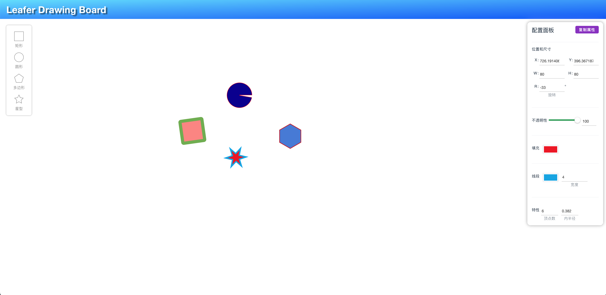

<!--
 * @Author: zi.yang
 * @Date: 2023-07-04 11:24:27
 * @LastEditors: zi.yang
 * @LastEditTime: 2023-08-05 19:37:49
 * @Description: 
 * @FilePath: /vue-project/README.md
-->
# Leafer Drawing Border

Vue3 + Vite + Leafer 实现的简易画板

> 不建议阅读代码，为了图省事代码并没有做太多优化，有大量的冗余代码与无用代码。

在线访问地址：[https://alexpang.cn/](https://alexpang.cn/)

## Project Setup

```sh
npm install
```

### Compile and Hot-Reload for Development

```sh
npm run dev
```

### Compile and Minify for Production

```sh
npm run build
```

## 截图


